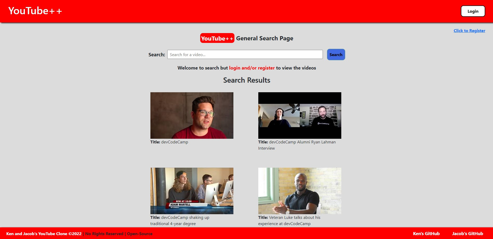

This was a collaborative full stack project for devCodeCamp's Full Stack Development bootcamp. This entailed cloning YouTube and coding the backend and frontend of the application. In addition, it incorporates protected and unprotected endpoints to support user authentication.

Technologies: React, JavaScript, HTML/CSS, Django, Django REST Framework, MySQL, Axios, and Postman

The following are some images of our YouTube clone: YouTube++:

Search Page (landing)

Home Page (logged-in)

